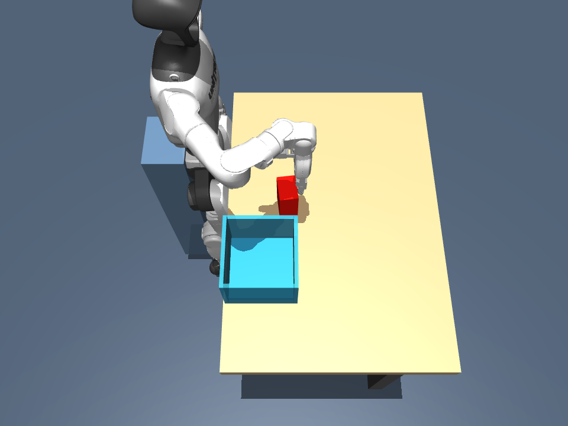
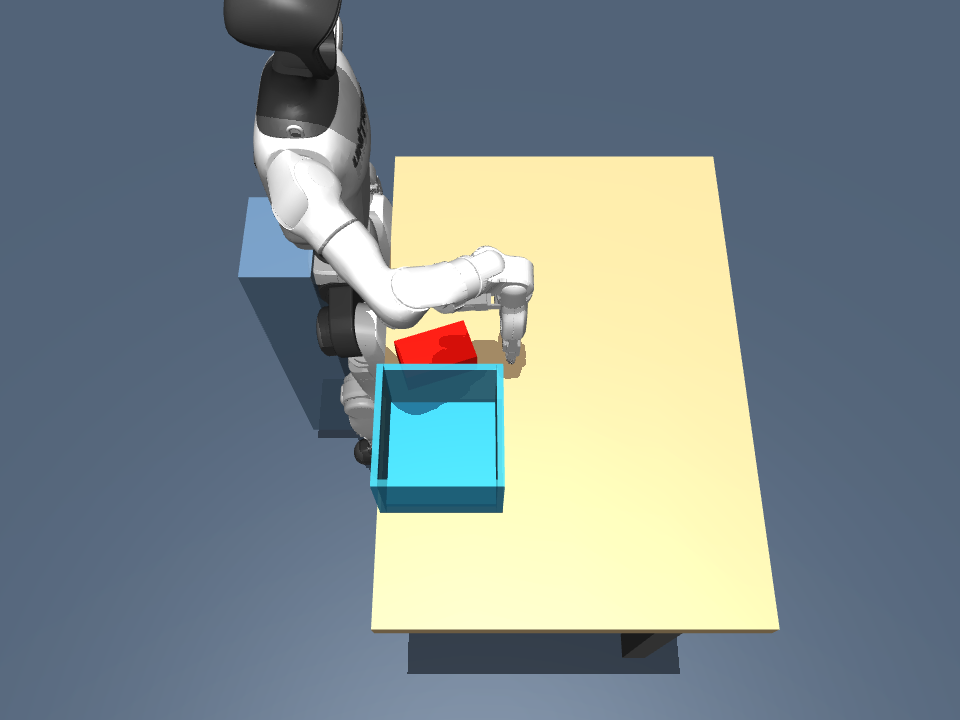

# C1 failure diagnosis

2026-09-14. Post-hoc analysis of the saved C1 episode, with **zero physics steps,
fresh resets or model invocations**. Original C1 actions, outcomes, guard thresholds
and evidence are unchanged. [Reproducible audit](../../scripts/audit_codex_c1.py),
[full numeric evidence](results/codex_C1_audit/audit.json),
[original result](CODEX_C1_RESULTS.md).

The failure began when the open hand struck and toppled the block during approach.
The subsequent descent targeted the old neighbourhood and would drive the index
and middle fingertips into the table. The production guard correctly rejected
that descent. Passing its earlier preflight did not establish safe block contact:
the guard explicitly excludes the manipulated object from its collision test.

## Saved observations and motion

These are the exact public images given to Codex, copied without editing.

| Before approach, t=1.0 s | After approach, t=2.5 s |
|---|---|
|  |  |

| Quantity | Measured result |
|---|---|
| Initial block centre, world metres | `[0.249256, -0.175484, 0.759999]` |
| Requested approach site | `[0.250, -0.184, 0.820]` |
| Requested site XY offset from initial block centre | 8.549 mm |
| First hand/block penetration in saved qpos samples | t=2.023 s, middle proximal link; 0.299 mm |
| Largest recomputed hand/block penetration in saved samples | 4.690 mm at t=2.089 s, middle proximal link |
| Original private scorer peak | **6.291 mm at t=2.093 s**, same proximal link |
| Final block centre | `[0.167262, -0.196480, 0.724999]` |
| Block displacement during approach | `[-81.994, -20.996, -35.000]` mm; **84.640 mm in XY** |
| Absolute world-Z component of block's original long axis | approximately 1 initially, 0 finally: block toppled |
| Requested next site XY offset from displaced block centre | **78.733 mm** |

The saved trajectory contains 79 qpos samples, approximately 30 Hz plus action
endpoints. Recomputing contacts from qpos does not reconstruct velocities or forces,
nor the scorer's 1 kHz contact history. The original 6.291 mm peak remains authoritative;
the smaller sampled maximum is not a correction to that score. The first sampled
contact time is not an exact collision-onset time. Original scorer normal force at
its peak was 0 N; no physical force or damage is inferred from geometric overlap.

Codex was given the new, visibly changed image before the third decision. Its
requested descent was near the original location rather than the displaced block.
That is evidence of a poor feedback action, not proof of what position it internally
estimated or whether it recognised the topple.

## Why the descent was rejected

The full final integration state is saved at t=2.5 s. Loading that state and calling
the unchanged production IK and `PolicyInterface.preflight` reproduces the exact
archived error. No action was executed and the loaded integration state remained
bit-for-bit unchanged.

The guard checks 101 joint-interpolation samples with measured finger joints held
fixed. Its first violating sample is **62/100**, with grasp-site Z=0.774768 m.
Collision pairs are the **table** and `right_hand_middle_1_link` /
`right_hand_index_1_link`. At that sample the deepest overlap is 2.390 mm, exceeding
the unchanged 2 mm threshold. Continuing the diagnostic sampling to the requested
endpoint predicts up to **21.909 mm** overlap. Those later samples were not executed.
The fraction 0.62 describes the sampled joint path, not elapsed simulation time.

The requested site Z=0.755 m was above the table's Z=0.700 m, but the site is not the
lowest part of the hand. This is the specific geometric reason the descent fails.

## What the geometry explains—and what it does not

At the actual pre-approach posture, collision vertices extended 78.333 mm below the
site. An independent kinematic calibration using only the robot model, fully open
finger joint targets and the downward orientation gives these occupied bounds:

| World-axis offset from the nominal grasp site | Minimum | Maximum |
|---|---:|---:|
| X | -73.552 mm | +57.201 mm |
| Y | -41.600 mm | +41.400 mm |
| Z | -76.960 mm | +84.748 mm |

The nominal calibration does not use episode state or block coordinates. It is
robot geometry, potentially suitable for a public contract. These boxes enclose
solid collision geometry; they are not a free grasp cavity, an exact envelope at
all articulations, or a guarantee of a collision-free swept path.

The first site target was approximately level with the upright block's top and
only 8.5 mm away in XY. The block therefore entered the occupied hand geometry
during descent, consistent with the observed proximal-link contact and toppling.
A large initial XY targeting error is not necessary to explain this failure.
However, action coordinates are not an explicit perception estimate: this audit
does not establish that Codex's visual localisation was accurate. Path choice,
hand-site interpretation and failure to respond to displacement remain distinct
contributors; the saved decisions do not reveal hidden reasoning.

## Verification and successor

- [x] Match every episode file to the retained C1 archive manifest.
- [x] Verify physical source hashes, scene and MuJoCo version against C1 provenance.
- [x] Reproduce the rejected production path without changing loaded state.
- [x] Keep approximately 30 Hz geometry separate from authoritative dynamic scoring.
- [x] Pass three audit regressions: recorded failure with physics/reset disabled,
  altered-evidence refusal, and output overlap/overwrite refusal. [Test log](results/codex_C1_audit/tests.txt).
- [x] Define [C2](protocols/C2_PROPOSAL.md) as a separate public-contract condition.

No production controller changed, so the validation here is the focused audit suite,
not a newly claimed full-suite run. Reproduce into a new directory from repository root:

```sh
PYTHONPATH=. .venv/bin/python scripts/audit_codex_c1.py --episode runtime/humanoid/codex-C1/seed-820 --output runtime/humanoid/new-c1-audit
```

C2 should test whether clearer robot geometry and explicit reassessment after
displacement improve behaviour. It must not receive this private report, measured
block positions, the rejected trajectory or a tuned grasp recipe. Guard thresholds,
task scoring, 20-decision/25-second budgets and unused seeds 840–849 remain unchanged.
