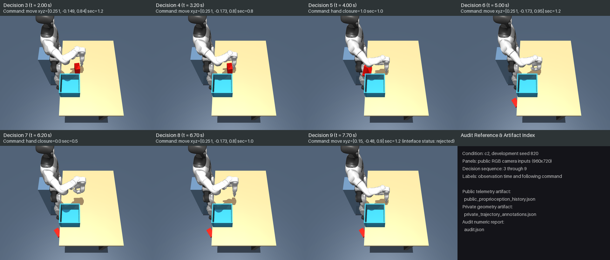

# C2 failure diagnosis

2026-09-15. Post-hoc offline analysis of the saved C2 episode, with **zero physics steps,
fresh resets or model invocations**. Original C1 and C2 actions, outcomes, guard thresholds,
and evidence archives are preserved byte-for-byte. [Reproducible audit](../../scripts/audit_codex_c2.py),
[full numeric evidence](results/codex_C2_audit/audit.json),
[contact sheet](results/codex_C2_audit/contact_sheet.png),
[public proprioception/history](results/codex_C2_audit/public_proprioception_history.json),
[private trajectory annotations](results/codex_C2_audit/private_trajectory_annotations.json),
[original result](CODEX_C2_RESULTS.md).

During Action 4 (`move [0.251, -0.173, 0.80]`, 0.8 s), the descending right hand contacted
the red block, toppling and displacing it 154.269 mm in XY (155.212 mm 3D) toward the table edge.
By the end of Action 5 (t=5.000 s), the destabilized block reached the floor (804.145 mm 3D
displacement from Action-4 start to floor height z=0.025 m). Subsequent commands (Decisions 6 and 8)
commanded hand targets in the original approach region ([0.251, -0.173, z]) while the block lay on
the floor; command JSON records requested coordinates and durations, not the model's internal belief
or strategy. Action 9 commanded an unreachable target at the table edge and was rejected by interface
inverse kinematics (residual 0.0542 m) without physics advance or state mutation.

---

## Saved observations and visual progression

Public observation images for Decisions 3–9 are assembled into an ordered contact sheet
from original saved PNGs using ordinary Pillow composition (no image generation or new rendering):

Labels on the contact sheet are strictly factual (observation time and following command).
Interpretive claims are excluded from the visual artifact:
- Public proprioception (`robot_state`) and public history are recorded in
  [`results/codex_C2_audit/public_proprioception_history.json`](results/codex_C2_audit/public_proprioception_history.json),
  distinguishing inputs preceding a decision from subsequent commands and execution outcomes.
- Ground-truth object states, contact pairs, and displacement data are kept in the separately
  labelled evaluator artifact [`results/codex_C2_audit/private_trajectory_annotations.json`](results/codex_C2_audit/private_trajectory_annotations.json).

AGY measures and assembles the evidence; Codex owns VLA interpretation and successor-condition decisions.

---

## Action 4 approach kinematics and contact measurements

Action 4 (`call_004`, t=3.200–4.000 s) executed a `move` to `[0.251, -0.173, 0.80]`, 0.8 s.

| Metric | Measured value | Attribution / Source |
|---|---|---|
| Initial block centre (t=3.200 s) | `[0.249256, -0.175484, 0.759999]` m | Sampled qpos geometry (sample 100) |
| Commanded grasp site | `[0.251, -0.173, 0.800]` m | Public action command |
| Final block centre (t=4.000 s) | `[0.096101, -0.193997, 0.742923]` m | Sampled qpos geometry (sample 125) |
| Block displacement in Action 4 (vector) | `[-153.155, -18.513, -17.076]` mm | Sampled qpos geometry |
| Block XY displacement in Action 4 | **154.269 mm** (`0.154269 m`) | Sampled qpos geometry |
| Block 3D displacement in Action 4 | **155.212 mm** (`0.155212 m`) | Sampled qpos geometry |
| Block rotation angle in Action 4 | 166.578° | Sampled qpos geometry |
| Final block upright axis \|Z\| | 0.000223 (toppled) | Sampled qpos geometry |
| First sampled hand/block contact | t=3.761 s, 0.274 mm penetration | Sampled qpos geometry (sample 117, `right_hand_middle_0_link`) |
| Sample nearest to scorer peak | t=3.794 s, 5.185 mm penetration | Sampled qpos geometry (sample 118, `right_hand_middle_0_link`) |
| Max sampled hand/block penetration | t=3.794 s, 5.185 mm penetration | Sampled qpos geometry (sample 118, `right_hand_middle_0_link`) |
| Scorer peak object penetration | **5.185 mm** (`0.005184672 m`) | Authoritative 1 kHz private scorer telemetry (t=3.795 s) |
| Scorer normal force at peak penetration | **25.51 N** (`25.506541 N`) | Authoritative 1 kHz private scorer telemetry (t=3.795 s) |
| Final block centre after Action 5 (t=5.000 s) | `[-0.022621, -0.355780, 0.024999]` m | Sampled qpos geometry (floor height) |
| Cumulative XY displacement (Act 4 start to Act 5 end) | **326.227 mm** (`0.326227 m`) | Sampled qpos geometry |
| Cumulative 3D displacement (Act 4 start to Act 5 end) | **804.145 mm** (`0.804145 m`) | Sampled qpos geometry (floor height) |

### Distinction: full-rate scorer telemetry vs sampled qpos geometry

- **Full-rate scorer telemetry**: The simulation evaluator runs at every 1 ms physics step
  (1000 Hz). It recorded peak penetration of 5.185 mm and **25.51 N normal force at peak penetration**
  at t=3.795 s against `right_hand_middle_0_link` (geom 98). The 25.51 N value is specifically the normal
  force measured at peak penetration, not a separately maximized normal force.
- **Sampled qpos geometry**: The saved trajectory records robot and object configuration at approximately
  30 Hz (dt ≈ 0.033 s). Nearest sample 118 (t=3.794 s) shows 5.185 mm geometric overlap with
  `right_hand_middle_0_link`. First sampled contact occurs at sample 117 (t=3.761 s, 0.274 mm penetration).
  Qpos trajectory analysis is post-hoc geometric reconstruction only; it cannot reconstruct continuous
  contact forces, normal impulses, or exact microsecond collision dynamics.

---

## Finger geometry vs nominal C2 bounds

The C2 prompt supplied approximate posture-specific bounds for the open hand in downward orientation:
- **Prompt nominal bounds (relative to site)**:
  - X: `[-0.074, +0.058]` m
  - Y: `[-0.042, +0.042]` m
  - Z: `[-0.077, +0.085]` m

Actual collision geometry along the Action 4 path was evaluated per sample from collision mesh vertices and box corners:
- Pre-approach actual bounds (t=3.200 s, sample 100):
  - World offset min: `[-0.0725, -0.0417, -0.0778]` m
  - World offset max: `[+0.0572, +0.0414, +0.0847]` m
  - Measured site orientation: quaternion `[0.495277, -0.496792, 0.504349, 0.503519]` (diff norm from `[0.5, -0.5, 0.5, 0.5]`: 0.007993)
- First contact bounds (t=3.761 s, sample 117):
  - World offset min: `[-0.0729, -0.0414, -0.0774]` m
  - World offset max: `[+0.0573, +0.0416, +0.0847]` m
- Peak contact bounds (t=3.794 s, sample 118):
  - World offset min: `[-0.0729, -0.0415, -0.0774]` m
  - World offset max: `[+0.0572, +0.0416, +0.0847]` m
- Overall Action 4 envelope across all 26 samples:
  - Min bounds: `[-0.0732, -0.0417, -0.0778]` m (departure: X +0.8 mm, Y +0.3 mm, Z -0.8 mm relative to prompt min)
  - Max bounds: `[+0.0575, +0.0418, +0.0847]` m (departure: X -0.5 mm, Y -0.2 mm, Z -0.3 mm relative to prompt max)
- Independent robot calibration (`nominal_open_hand_geometry`): downward IK at `[0.24, -0.18, 0.94]`, closure 0:
  X `[-0.0736, +0.0572]`, Y `[-0.0416, +0.0414]`, Z `[-0.0770, +0.0847]` m

### Applicability and physical evidence

The prompt bounds supplied approximate bounds for an ideal nominal posture. In actual execution:
1. Measured lower Z bounds extend to -0.0778 m pre-approach, departing by 0.8 mm below the nominal -0.077 m boundary.
   Joint articulation under contact further deflects finger links (e.g. middle finger joint reaches 0.112 rad at sample 118).
2. Overlapping bounding boxes alone do not prove mesh collision, nor does an envelope describe a solid volume.
3. The empirical evidence for collision in this episode is the recorded kinematic path and contact pairs:
   physical contact begins at sample 117 (t=3.761 s) between `right_hand_middle_0_link` (geom 98) and `object` (geom 105)
   with 0.274 mm penetration, deepening to 5.185 mm penetration at sample 118 (t=3.794 s), accompanied by block toppling
   and 154.269 mm horizontal displacement.

---

## Action 9 IK reachability rejection

Action 9 commanded `move` to `[0.15, -0.48, 0.90]`, 1.2 s, orientation `[0.5, -0.5, 0.5, 0.5]`.

- **Production rejection**: Rejected before execution by interface inverse kinematics:
  `Unreachable hand pose [0.15, -0.48, 0.9]: residual 0.0542 m`.
- **Scratch-data reproduction**: Loading the preserved final integration state at t=7.70 s and calling
  `Environment.solve` on scratch data reproduced the exact error string.
- **Derived residual**: The IK residual is derived directly from the reproduced error as **0.0542 m** (four-decimal precision).
- **Integration state preservation**: `before == after` integration state check passes bit-for-bit
  (`final_integration_state_unchanged: True`). Zero physics advance or state mutation occurred.

---

## Descriptive comparison: C1 vs C2

All C1 and C2 metrics are derived directly from retained evidence archives
([`codex_C1_episode.zip`](results/codex_C1_episode.zip), SHA-256 `19f3313d...`;
[`codex_C2_episode.zip`](results/codex_C2_episode.zip), SHA-256 `940f3ef7...`):

| Metric | C1 (Seed 820) | C2 (Seed 820) |
|---|---|---|
| Protocol ID | `humanoid-codex-c1-development` | `humanoid-codex-c2-development` |
| First damaging action | Action 2 (`move [0.250, -0.184, 0.820]`) | Action 4 (`move [0.251, -0.173, 0.800]`) |
| First damaging action interval | t = 1.000–2.500 s (1.5 s) | t = 3.200–4.000 s (0.8 s) |
| First damaging action XY displacement | **84.640 mm** | **154.269 mm** |
| First damaging action 3D displacement | **91.591 mm** | **155.212 mm** |
| Subsequent displacement interval | None (Action 3 rejected) | Action 4 start to Action 5 end (t=3.200–5.000 s) |
| Subsequent XY displacement | — | **326.227 mm** |
| Subsequent 3D displacement | — | **804.145 mm** (floor height z=0.025 m) |
| Block final posture | Toppled on table | Toppled on table (Act 4), on floor (Act 5) |
| Sustained lift | 0/1 (max bottom 0.7010 m, +1.0 mm) | 0/1 (max bottom 0.7095 m, +9.5 mm) |
| Physical placement | 0/1 | 0/1 |
| Quality pass (penetration ≤ 2 mm) | Failed (6.291 mm peak) | Failed (5.185 mm peak) |
| Scorer normal force at peak penetration | 0.0 N | 25.51 N |
| Terminating stop reason | Collision preflight guard rejection (table overlap) | Interface IK reachability rejection (residual 0.0542 m) |
| Completed actions | 2 | 8 |
| Total simulated duration | 2.50 s | 7.70 s |

**Efficacy disclaimer**: C1 and C2 share a single development seed (820). Differences in action sequence,
completed action count, or displacement values are descriptive development observations. They do not constitute
statistical or causal evidence of controller efficacy or task improvement.

---

## Verification and test coverage

- [x] Verified pinned C2 archive SHA-256 (`940f3ef71518a15f9f171adb877c108596060142b9f1e08276146ad876bd95f8`)
      and all 73 members against manifest before trusting archive contents.
- [x] Verified frozen provenance source file hashes and scene hash match current repository.
- [x] Reproducible offline audit executed with zero physics steps, resets, or model calls.
- [x] Action 9 IK rejection reproduced on scratch data with zero state mutation (residual 0.0542 m).
- [x] Ordered contact sheet generated with Pillow from original public images for Decisions 3–9 with factual labels only.
- [x] Public proprioception (`robot_state`) and history verified non-null and matched byte-for-byte to archived requests.
- [x] Separated public telemetry and private ground-truth annotations into distinct artifacts.
- [x] 11 audit tests (8 C2 + 3 C1) pass cleanly, including source/scene mismatch failure paths and `Popen` model guard:
      [`results/codex_C2_audit/tests.txt`](results/codex_C2_audit/tests.txt).
- [x] Arithmetic self-reviewed against raw JSON evidence.
